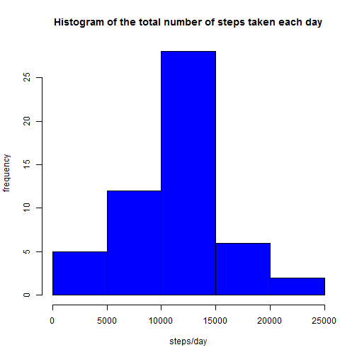
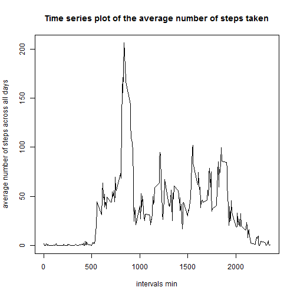
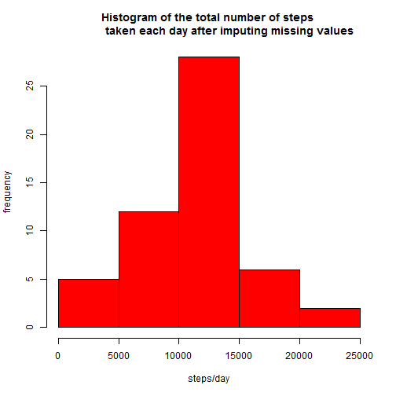
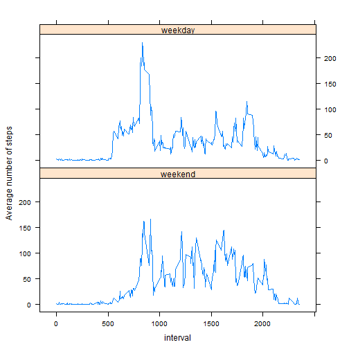

Reproducible Research: Peer Assessment 1
========================
## Loading and preprocessing the data
I loaded the data file in order to analyze it.

```r
data<-read.csv("activity.csv")
```
I used the dplyr package in this assignment so I loaded the installed package.

```r
library(dplyr)
```
In order to get the number of total steps each day with exclusion of missing values,
a data frame (d) without missing values was created and grouped by date and then the sum
of steps for each day was calculated.

```r
d<-filter(data, !is.na(steps))%>%
        group_by(date)%>%
        summarize(total.steps=sum(steps))
```
## What is the mean total number of steps taken per day?
The mean and median of the total number of steps taken per day were then calculated as shown below.

```r
mean(d$total.steps)
```

```
## [1] 10766.19
```

```r
median(d$total.steps)
```

```
## [1] 10765
```
This was followed by drawing a histogram of the total number of steps taken each day.

```r
hist(d$total.steps, col="blue", main="Histogram of the total number of steps taken each day",xlab="steps/day", ylab="frequency")
```


## What is the average daily activity pattern?
In order to detrmine the average daily activity pattern, another dataframe (d2) with missing values excluded was created and grouped by the 5-min-intervals and the then the average number of steps for each interval was calculated. The head of the produced dataframe is shown below the code.

```r
d2<-filter(data, !is.na(steps))%>%
        group_by(interval)%>%
        summarize(total.steps= sum(steps),avg.steps=mean(steps))
print(d2)
```

```
## Source: local data frame [288 x 3]
## 
##    interval total.steps avg.steps
##       (int)       (int)     (dbl)
## 1         0          91 1.7169811
## 2         5          18 0.3396226
## 3        10           7 0.1320755
## 4        15           8 0.1509434
## 5        20           4 0.0754717
## 6        25         111 2.0943396
## 7        30          28 0.5283019
## 8        35          46 0.8679245
## 9        40           0 0.0000000
## 10       45          78 1.4716981
## ..      ...         ...       ...
```
Plotting of a time series plot of the average number of steps taken was done as shown.

```r
plot(d2$interval, d2$avg.steps, type="l",
     main="Time series plot of the average number of steps taken",
        xlab="intervals min", ylab="average number of steps across all days")
```



And then the maximum average of steps was determined.

```r
max(d2$avg.steps)
```

```
## [1] 206.1698
```
To determine to which interval it belongs, the following code was used.

```r
subset(d2$interval,d2$avg.steps== max(d2$avg.steps))
```

```
## [1] 835
```
## Imputing missing values
In order to impute missing values, it was important to determine the total number of missing values in the original dataframe(data) .

```r
sum(is.na(data$steps))
```

```
## [1] 2304
```
we can observe here that I choose "steps" column  as all missing values were in this column; however, using the whole dataframe will render the same value.
The next step was to imputing missing values in a new datframe named data2.

```r
data2<-data
```
The missing values were replaced with the average number of steps for each interval using the following code. We will note that this code produces a warning which can be ignored as it does not affect the results.

```r
data2$steps[is.na(data2$steps)]<-d2$avg.steps[match(data2$interval,d2$interval)]
```

```
## Warning in data2$steps[is.na(data2$steps)] <-
## d2$avg.steps[match(data2$interval, : number of items to replace is not a
## multiple of replacement length
```
Just to check that missing values were correctly replaced we can check the head of our new dataframe.

```r
head(data2)
```

```
##       steps       date interval
## 1 1.7169811 2012-10-01        0
## 2 0.3396226 2012-10-01        5
## 3 0.1320755 2012-10-01       10
## 4 0.1509434 2012-10-01       15
## 5 0.0754717 2012-10-01       20
## 6 2.0943396 2012-10-01       25
```
In addition we can create the dataframe grouped by interval once more and check the total number of steps and the average steps for each interval.

```r
d3<- group_by(data2,interval)%>%
        summarize(total.steps= sum(steps),avg.steps=mean(steps))
print(d3)
```

```
## Source: local data frame [288 x 3]
## 
##    interval total.steps avg.steps
##       (int)       (dbl)     (dbl)
## 1         0  104.735849 1.7169811
## 2         5   20.716981 0.3396226
## 3        10    8.056604 0.1320755
## 4        15    9.207547 0.1509434
## 5        20    4.603774 0.0754717
## 6        25  127.754717 2.0943396
## 7        30   32.226415 0.5283019
## 8        35   52.943396 0.8679245
## 9        40    0.000000 0.0000000
## 10       45   89.773585 1.4716981
## ..      ...         ...       ...
```
We can observe that the total number of steps has increased for each interval without affecting te average number of steps.

To get the total number of steps per day after imputing missing values, d4 dataframe was created followed by plotting a histogram of the total number of steps taken each day after imputing missing values.

```r
d4<-group_by(data2,date)%>%
        summarize(total.steps=sum(steps))
hist(d$total.steps, col="red", main="Histogram of the total number of steps 
             taken each day after imputing missing values",
             xlab="steps/day", ylab="frequency")
```


## Are there differences in activity patterns between weekdays and weekends?
The next assignment was to check the pattern of average steps between weekdays and weekends in the dataframe with imputed missing values (data2).
First, I checked the class of the date variable in data2.

```r
class(data2$date)
```

```
## [1] "factor"
```
As we can see, the class appears to be a factor so it must be converted into POSIXct.

```r
data2$date<-as.POSIXct(data2$date)
```
To aid in classifying the weekdays into weekend and weekday, I created a vector named weekend.vec.

```r
weekend.vec<-c("Saturday", "Sunday")
```
I created a new column -with aid of dplyr package-  which is a factor with two levels "weekday"& "weekend" as shown in the following code.

```r
data2<-mutate(data2,wk.day=factor((weekdays(data2$date) %in% weekend.vec), 
                                  levels=c(TRUE, FALSE), labels=c("weekend", "weekday")))
```
To check the presence of our new column with its correct information, I ran the following commands.

```r
data2[4030:4050,]
```

```
##      steps       date interval  wk.day
## 4030     0 2012-10-14     2345 weekend
## 4031     0 2012-10-14     2350 weekend
## 4032     0 2012-10-14     2355 weekend
## 4033     0 2012-10-15        0 weekday
## 4034     0 2012-10-15        5 weekday
## 4035     0 2012-10-15       10 weekday
## 4036     0 2012-10-15       15 weekday
## 4037     0 2012-10-15       20 weekday
## 4038    35 2012-10-15       25 weekday
## 4039     0 2012-10-15       30 weekday
## 4040     0 2012-10-15       35 weekday
## 4041     0 2012-10-15       40 weekday
## 4042     0 2012-10-15       45 weekday
## 4043     0 2012-10-15       50 weekday
## 4044     0 2012-10-15       55 weekday
## 4045     0 2012-10-15      100 weekday
## 4046     0 2012-10-15      105 weekday
## 4047     0 2012-10-15      110 weekday
## 4048     0 2012-10-15      115 weekday
## 4049     0 2012-10-15      120 weekday
## 4050     0 2012-10-15      125 weekday
```
And to check the class of this newly created variable, I used the following commands.

```r
class(data2$wk.day)
```

```
## [1] "factor"
```

```r
levels(data2$wk.day)
```

```
## [1] "weekend" "weekday"
```
To get the average number of steps at each interval in weekends & weakdays, I grouped data2 was grouped according to both variables then the mean was calculated using dplyr package.

```r
d5<-group_by(data2,wk.day,interval)%>%
        summarize(average.steps=mean(steps))
print(d5)
```

```
## Source: local data frame [576 x 3]
## Groups: wk.day [?]
## 
##     wk.day interval average.steps
##     (fctr)    (int)         (dbl)
## 1  weekend        0   0.214622642
## 2  weekend        5   0.042452830
## 3  weekend       10   0.016509434
## 4  weekend       15   0.018867925
## 5  weekend       20   0.009433962
## 6  weekend       25   3.511792453
## 7  weekend       30   0.066037736
## 8  weekend       35   0.108490566
## 9  weekend       40   0.000000000
## 10 weekend       45   0.558962264
## ..     ...      ...           ...
```
In order to compare the relationship between  the 5-minute-intervals and the average number of steps in weekdays & weekends, a time-series plot using lattice package was plotted.

```r
library(lattice)
xyplot(average.steps~interval|wk.day, data=d5, xlab= "interval", 
       ylab="Average number of steps", layout=c(1,2), type="l" )
```


